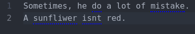

# atom-grammar-check

This atom plugin highlights the syntax and spell mistakes in your editor.

## Features:

* Highlight mistakes
* Suggest replacing text
* Support excluded range (stolen from [spell-check](https://github.com/atom/spell-check) module)

## Correcter modules

There is 2 modules implemented:

1. **ginger** that work online (using gingerbread library)
2. **languagetool** that can work online and offline and support more than 20 languages. Due to the big amount of requests, it's recommended to have a local server.

## ToDO:

* Optimization?
* Take in account the file type (do not correct some given file types)
* On/Off toggle
* Other language support
* Offline support (currently using ginger via gingerbread module)